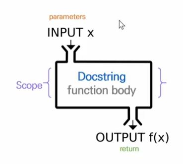
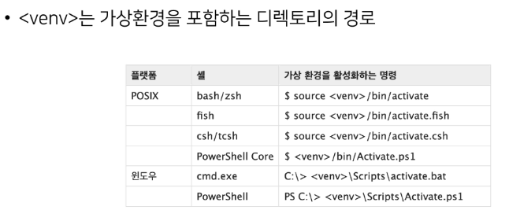

### 조건 표현식

true인 경우의 값 **`if`** 조건 **`else`** false인 경우의 값
ex) `value = num if num >= 0 else -num` : 절댓값을 저장하기 위한 코드

## for문

### Dictionary 순회

- 딕셔너리는 기본적으로 key를 순회하며, key를 통해 값을 활용한다
- 추가 메서드
     - keys(): key로 구성된 결과
     - values(): value로 구성된 결과
     - items(): (key, value)의 튜플로 구성된 결과

### enumerate 순회

- enumerate(list, start = 0)

     - 인덱스와 객체를 쌍으로 담은 열거형(enumerate) 객체 반환
     - (index, value) 형태의 tuple로 구성된 열거 객체를 반환
     - `start = n`을 통해 인덱스를 n부터 시작할 수 있다. (기본값 0)

     ```
     members = ['A', 'B', 'C']
     for idx, number in enumerate(members):
         print(idx, number)

     # 0 A
     # 1 B
     # 2 C
     ```

### List Comprehension

- 표현식과 제어문을 통해 특정한 값을 가진 리스트를 간결하게 생성하는 방법. 진짜 많이 쓴다
  `[code for 변수 in iterable if 조건식]`

```
cubic_list = [number ** 3 for number in range(1, 4)]
print(cubic_list)

# [1, 8, 27]
```

### Dictionary Comprehension

- 표현식과 제어문을 통해 특정한 값을 가진 딕셔너리를 간결하게 생성하는 방법.
  `{key: value for 변수 in iterable if 조건식}`

```
cubic_dict = {num: num ** 3 for num in range(1, 4)]
print(cubic_dict)

# {1: 1, 2: 8, 3: 27}
```

## 함수

- 함수를 사용하는 이유
     - Decomposition(분해) : 기능을 분해하고, 재사용 가능하게 만든다. 간결하고, 이해하기 쉽게 만든다
     - Abstraction(추상화) : 복잡한 내용을 모르더라도 사용할 수 있도록 한다. 재사용성과 가독성, 생산성 높이는데 쓰인다

### 함수의 종류

- 내장 함수: 파이썬에 기본적으로 포함 된 함수
- 외장 함수: import문을 통해 사용하며, 외부 라이브러리에서 제공하는 함수
- 사용자 정의 함수: 사용자가 직접 만드는 함수

### 함수의 정의

- 함수(Function)
     - 특정한 기능을 하는 코드의 조각(묶음)
     - 특정 코드를 매번 다시 작성하지 않고, 필요시에만 호출하여 간편히 사용

### 함수 기본 구조

- 선언과 호출(define & call)
- 입력(input)
- 문서화(docstring)
- 범위(scope)
- 결과값(output)

  

### 함수의 결과값

- return이 없다면 None 반환
- return이 있다면 하나를 반환
- 두 개 이상의 값 반환 : 튜플, 리스트와 같은 컨테이너 이용

### 함수의 입력

- Parameter: 함수를 **정의** 할 때, 함수 내부에서 사용되는 변수
- Argument: 함수를 **호출** 할 때, 넣어주는 값

     - 함수의 소괄호 안에 할당 `func_name(argument)`
     - 필수 Argument: 반드시 전달되어야 하는 Argument. 없으면 에러남
     - 선택 Argument: 값을 전달하지 않아도 되는 경우는 기본값이 전달
     - Positional Arguments: 기본적으로 함수 호출 시 Argument는 위치에 따라 함수 내에 전달됨
     - Keyword Argument: 직접 변수의 이름으로 특정 Argument를 전달할 수 있음
     - **Keywork Argument 다음에 Positional Argument를 활용할 수 없음!**

     ```
     def add(x, y)
         return x + y
     add(2, y = 5)   # 가능
     add(x = 2, 5)   # 에러 발생
     ```

     - Default Argument Values: 기본값을 지정하여 함수 호출 시 argument 값을 설정하지 않도록 함. 정의된 것 보다 더 적은 개수의 argument들로 호출될 수 있음

     ```
     def add(x, y=0) # Default Argument Value
         return x + y
     add(2)   # 가능
     ```

     - 정해지지 않은 여러 개의 Arguments 처리: 애스터리스크(Asterisk, 언패킹 연산자)라고 불리는 \* 덕분.
          - 가변 인자(\*args): 여러 개의 Positional Argument를 하나의 필수 parameter로 받아서 사용. 몇 개의 Positional Argument를 받을지 모르는 함수를 정의할 때 유용
               ```
               def add(*args)
                   for arg in args:
                       print(arg)
               add(2)   # 가능
               add(2, 3, 4)   # 가능
               ```
          - 패킹: 여러 개의 데이터를 묶어서 변수에 할당하는 것
            `numbers = (1, 2, 3, 4, 5)`
          - 언패킹: 시퀀스 속의 요소들을 여러 개의 변수에 나누어 할당하는 것
            `a, b, c, d, e = numbers`
          - 언패킹시 변수의 개수와 할당하고자 하는 요소의 갯수가 동일해야함
          - 언패킹시 왼쪽의 변수에 asterisk(*)를 붙이면, 할당하고 남은 요소를 리스트에 담을 수 있음
            `a, b, *rest = numbers # 1, 2, [3, 4, 5]` `a, \*rest, e = numbers # 1, [2, 3, 4], 5`
          - Asterisk(\*)와 가변 인자
               - \*는 시퀀스 언패킹 연산자라고도 불리며, 말 그대로 시퀀스를 풀어 헤치는 연산자이다.
               - 주로 튜플이나 리스트를 언패킹하는데 사용
               - \*를 활용하여 가변 인자를 만들 수 있음
     - 가변 키워드 인자(**kwargs): 몇 개의 키워드 인자를 받을지 모르는 함수를 정의할 때 유용. 딕셔너리로 묶여 처리되며, parameter에 **를 붙여 표현

          ```
          def family(**kwargs)
              for key, value in kwargs.items():
                  print(key, ":", value)
          family(father = '아버지', mother = '어머니', baby = '아기')

          # father : 아버지
          # mother : 어머니
          # baby : 아기
          ```

     - 가변 인자와 가변 키워드 인자를 함께 사용할 수 있다.

## Python의 범위(scope)

- scope
     - global scope: 코드 어디에서든 사용(참조)할 수 있는 공간
     - local scope: 함수가 만든 scope. 함수 내에서만 참조 가능
- variable
     - global variable: global scope에 정의된 변수
     - local variable: local scope에 정의된 변수

### 변수 수명주기(life cycle)

- built-in scope: 파이썬이 실행된 이후부터 영원히 유지
- global scope: 모듈이 호출된 시점 이후 혹은 인터프리터가 끝날 때까지 유지
- local scope: 함수가 호출될 때 생성되고, 함수가 종료될 때까지 유지

### 이름 검색 규칙(Name Resolution, LEGB Rule)

- Local scope: 지역 범위(현재 작업 중인 범위)
- Enclosed scope: 지역 범위 한 단계 위 범위
- Global scope: 최상단에 위치한 범위
- Built-in scope: 모든 것을 담고 있는 범위 (정의하지 않고 사용할 수 있는 모든 것) ex) `print()`
- 함수 내에서는 바깥 Scope의 변수에 접근 가능하나 수정은 할 수 없음

### global 문

- 현재 코드 블록 전체에 적용되며, 나열된 식별자(이름)이 global variable임을 나타냄
     - global에 나열된 이름은 같은 코드 블록에서 global 앞에 등장할 수 없음
     - global에 나열된 이름은 parameter, for 루프 대상, 클래스/함수 정의 등으로 정의되지 않아야 함

### nonlocal

- global을 제외하고 가장 가까운(둘러싸고 있는) scope의 변수를 연결하도록 함
     - nonlocal에 나열된 이름은 같은 코드 블록에서 nonlocal 앞에 등장할 수 없음
     - nonlocal에 나열된 이름은 parameter, for 루프 대상, 클래스/함수 정의 등으로 정의되지 않아야 함
     - global과는 달리 이미 존재하는 이름과의 연결만 가능함

### 함수 정리

- 기본적으로 함수에서 선언된 변수는 Local scope에 생성되며, 함수 종료 시 사라짐
- 해당 scope에 변수가 없는 경우 LEGB rule에 의해 이름을 검색함
     - 변수에 접근은 가능하지만, 해당 변수를 수정할 수는 없음
     - 값을 할당하는 경우 해당 scope의 이름공간에 새롭게 생성되기 때문
     - 단, 함수 내에서 필요한 상위 scope 변수는 argument로 넘겨서 활용할 것
- 상위 scope에 있는 변수를 수정하고 싶다면 global, nonlocal 키워드 활용 가능
     - 단, 코드가 복잡해지면서 변수의 변경을 추적하기 어렵고, 예기치 못한 오류가 발생
     - 가급적 사용하지 않는 것을 권장하며, 함수로 값을 바꾸고자 한다면 항상 argument로 넘기고 리턴 값을 사용하는 것을 추천

## 함수 응용

### map

- map(function, iterable)
- 순회 가능한 데이터구조(iterable)의 모든 요소에 함수(function)적용하고, 그 결과를 map object로 반환
- 리스트 형변환을 통해 결과를 직접 확인할 수 있다

### filter

- filter(function, iterable)
- 순회 가능한 데이터구조(iterable)의 모든 요소에 함수(function)적용하고, 그 결과가 True인 것들을 filter object로 반환
  `filter(odd, numbers) # 홀수만 filter object로 반환`
- 리스트 형변환을 통해 결과를 직접 확인할 수 있다

### zip

- zip(\*iterables)
- 복수의 iterable을 모아 튜플을 원소로 하는 zip object를 반환
- 리스트 형변환을 통해 결과를 직접 확인할 수 있다
     ```
     girls = ['jane', 'susan']
     boys = ['justin', 'eric']
     pair(zip(girls, boys))
     print(list(pair))   # [('jane', 'justin'). ('susan', 'eric')]
     ```
## 함수 응용
### lambda 함수
* lambda[parameter]
* 표현식을 계산한 결과값을 반화난ㄴ 함수로, 이름이 없는 함수여서 익명함수라고도 불림
* 특징
     * return 문을 가질 수 없음
     * 감편 조건문 외 조건문이나 반복문을 가질 수 없음
* 장점
     * 함수를 정의해서 사용하는 것보다 간결하게 사용 가능
     * def를 사용할 수 없는 곳에서도 사용가능
```
# 삼각형의 넓이를 구하는 공식
triangle_area = lambda b, h : 0.5 * b * h
print(triangle_area(5, 6))    # 15.0
```

### 재귀 함수(recursive function)
* 자기 자신을 호출하는 함수
* 무한한 호출을 목표로 하는 것이 아니며, 알고리즘 설계 및 구현에서 유용하게 활용
     * 알고리즘 중 재귀 함수로 로직을 표현하기 쉬운 경우가 있음(ex. 점화식)
     * 변수의 사용이 줄어들며, 코드의 가독성이 높아짐
* 1개 이상의 base case(종료되는 상황)가 존재하고, 수렴하도록 작성
* Factorial(5!), 피보나치 수열
* 주의사항
     * 재귀 함수는 base case에 도달할 때까지 함수를 호출함
     * 메모리 스택이 넘치게 되면(stack overflow) 프로그램이 동작하지 않게 됨
     * 파이썬에서는 최대 재귀 깊이(maximum recursion depth)가 1,000번으로, 호출 횟수가 이를 넘어가게 되면 Recursion Error 발생
* 반복문과 재귀 함수 비교
     * 알고리즘 자체가 **재귀적인 표현이 자연스러운 경우** 재귀함수를 사용함
     * 재귀 호출은 변수 사용을 줄여줄 수 있음
     * 재귀 호출은 입력 값이 커질 수록 연산 속도가 오래 걸림

## 모듈과 패키지
* 외부 개발자가 만든 것을 가져다 쓰는 것
* 모듈: 다양한 기능을 하나의 파일로 모아둔 것
* 패키지: 다양한 파일을 하나의 폴더로 모아둔 것
* 라이브러리: 다양한 패키지를 하나의 묶음으로 모아둔 것
* 라이브러리 vs 프레임워크 = 삽(주도권이 나에게) vs 포크레인(내가 쓰긴 하는데 마음대로 조절 어려움)
* pip: 관리자
* 가상환경: 패키지의 활용 공간

### 모듈
* 특정 기능을 하는 코드를 파이썬 파일(.py) 단위로 작성한 것
```
import module
from module import var, function, Class
from module import *     # 전부 가져오기
```

### 패키지
* 특정 기능과 관련된 여러 모듈의 집합
* 패키지 안에는 또 다른 서브 패키지를 포함
```
from package import module
from package.module import var, function, Class
```

### 파이썬에 기본적으로 설치된 모듈과 내장 함수
* https://docs.python.org/ko/3/library/index.html
* ex) random.py
### 파이썬 패키지 관리자(pip)
* PyPI(Python Package Index)에 저장된 외부패키지들을 설치하도록 도와주는 패키지 관리 시스템
* 패키지 설치
     * 최신 버전 / 특정 버전 / 최소 버전을 명시하여 설치할 수 있음
     ```
     $ pip install SomePackage     # 최신 버전
     $ pip install SomePackage == 1.0.5     # 특정 버전
     $ pip install SomePackage >= 1.0.4    # 최소 버전
     ```
     * 설치 후 import해서 사용 가능
     * 이미 설치되어 있는 경우 이미 설치되어 있음을 알리고 아무것도 하지 않음
     * 모두 bash, cmd 환경에서 사용되는 명령어
* 패키지 삭제
     * pip는 패키지 업그레이드를 하는 경우 과거 버전을 자동으로 지워줌
     `$ pip uninstall SomePackage`
* 패키지 목록 및 특정 패키지 정보
     `$ pip list`
     `$ pip show SomePackage`
* 패키지 관리하기
     * 아래의 명령어들을 통해 패키지 목록을 관리하고 설치할 수 있음
     * 일반적으로 패키지를 기록하는 파일의 이름은 requuirements.txt로 정의함
     `$ pip freeze > requuirements.txt` : 설치된 리스트를 박제
     `$ pip install -r requuirements.txt` : 박제된 리스트 그대로 설치

## 모듈/패키지 활용하기
* 패키지는 여러 모듈/하위 패키지로 구조화
* 모든 폴도에는 __init.py를 만들어 패키지로 인식
     * Python 3.3부터는 파일이 없어도 되지만, 하위 버전 호환 및 프레임워크 등의 동작을 위해 파일을 생성하는 것을 권장
* 패키지 만들기: 계산 기능이 들어간 calculator 패키지를 아래와 같이 구성
     * check.py에서 calculator의 tools.py의 기능을 사용
     * 폴더 구조:
     ```
     my_package/
          __init__.py
          check.py
          calculator/
               __init__.py
               tools.py
     ```
* 모듈 만들기: calculator/tools.py에 add와 minus 함수 작성
     * 활용하기:
     ```
     # check.py에서
     from calculator import tools
     print(dir(tools))   # tool에 어떤 변수와 메소드를 가지고 있는지 나열
     print(tools.add(3, 5))   # 8
     ```

## 가상환경
* 파이썬 표준 라이브러리가 아닌 외부 패키지와 모듈을 사용하는 경우 모두 pip를 통해 설치를 해야함
* **복수의 프로젝트**를 하는 경우 버전이 상이할 수 있는데, 이러한 경우 가상환경을 만들어 프로젝트별로 독립적인 패키지를 관리할 수 있음
* 가상 환경을 만들고 관리하는데 사용되는 모듈
* 특정 디렉토리에 가상 환경을 만들고, 고유한 파이썬 패키지 집합을 가질 수 있음
     * 특정 폴더에 가상 환경이(패키지 집합 폴더 등) 있고
     * 실행 환경(ex. bash)에서 가상환경을 활성화 시켜
     * 해당 폴더에 있는 패키지를 관리/ 사용함
### 가상 환경 생성
` $ python -m venv <폴더명>`
* 가상환경을 생성하면, 해당 디렉토리에 별도의 파이썬 패키지가 설치됨
### 가상환경 활성화/비활성화
* 아래의 명령어를 통해 가상환경을 활성화


* 가상환경 비활성화 : `$ deactivate`
* cmd와 bash 환경에서 활성화: `source venv/Scripts/activate` 
* 동일 컴퓨터에서 각 프로젝트별로 별도의 가상환경을 생성할 수 있다

## 온라인 실습

### 윤년 계산하기

calendar 모듈 사용하기

```
def leap_year(year):
    import calendar
    if calendar.isleap(year):
        # True
        print('윤년입니다')
    else:
        # False
        print('윤년이 아닙니다')
```
