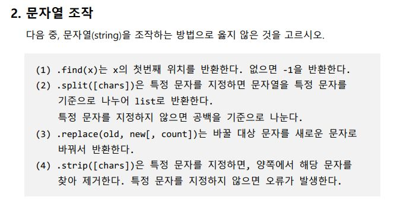
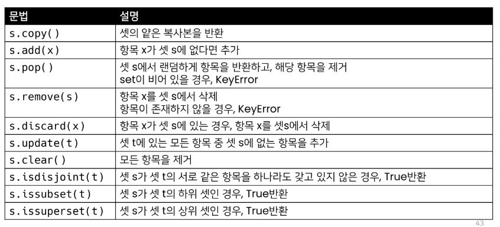
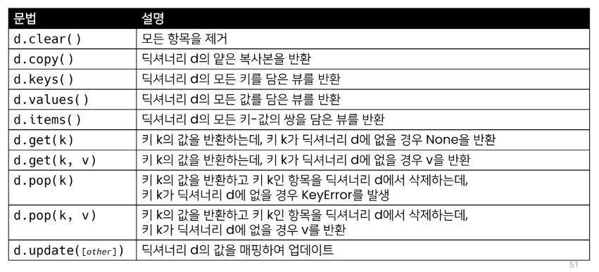

## 월말평가 Review

### 이진수 문제

알파벳은 26개이기 때문에 n이 26을 넘을 경우 처리해야 된다
-> 그냥 26을 빼는 것이 아닌 n을 26으로 나눈 나머지를 뺐어야 했다..
`caesar_num = ord(letter) + (n % 26)`

## 0725 Homework

수업을 잘 들어야 하는 이유..

2번에서 `.split([chars])`은~ 써있는것에서 `([chars])`가 문자열을 넣는다는 뜻인줄 알았는데 공식 표기법에 따라서 메서드에 넣어도 되고 안넣어도 되는건 []안에 넣는 다는 뜻이었다. 고로 2번은 맞는 말. 귀찮아서 필기 안했었는데 바로 필기 해놔야겠다..

## 파이썬 공식 문서의 표기법(배커스-나우르 표기법)

- 컴퓨터 언어에서 언어의 문법을 수학적인 수식으로 나타낼 때 사용하는 언어 도구
- 프로그래밍 언어의 구문을 기술하는 데 매우 자연스러운 표기법
     - python 구문이 아니며, 배커스-나우르 표기법(문서 표준일 뿐)
- `str.replace(old, new[, count])` : `old, new`는 필수 / `[, count]`는 선택적 인자를 의미함

## 데이터 구조

### 데이터 구조 활용

- 데이터 구조를 활용하기 위해서는 메서드를 활용한다
     - 메서드는 클래스 내부에 정의한 함수
     - 객체의 기능
     - 주어.동사()

## 문자열

- 모든 문자는 str 타입(변경 불가능한, immutable)

### 문자열 조회/탐색 및 검증 메서드

- `s.find(x)`: x의 첫 번째 위치를 반환. 없으면 -1을 반환함
- `s.index(x)`: x의 첫 번째 위치를 반환. 없으면 오류 발생
     - find와 index는 비슷하지만 find는 값을 반환하고, index는 오류를 발생시킨다는 점 유념하기
- 문자열 검증 메서드: `isdecimal() ⊆ isdigit() ⊆ isnumeric()`

### 문자열 변경 메서드

- 문자열은 immutable인데, 문자열 변경이 되는 이유는 기존의 문자열을 변경하는 것이 아니라, 변경된 문자열을 새롭게 만들어서 반환하기 때문이다.
- `s.replace(old, new[, count])`: 바꿀 글자를 새로운 글자로 바꿔서 변환. count를 지정하면 해당 개수만큼만 시행
- `s.strip([chars])`: 특정한 문자들을 지정하면,
     - 양쪽을 제거하거나(strip), 왼쪽을 제거하거나(lstrip), 오른쪽을 제거(rstrip)
     - 문자열을 지정하지 않으면 공백을 제거함
- `s.split(sep=None, maxsplit=-1)`: 문자열을 특정한 단위로 나눠 리스트로 반환
     - sep이 None이거나 지정되지 않으면 연속된 공백문자를 단일한 공백문자로 간주하고, 선행/후행 공백은 빈 문자열에 포함시키지 않음.
     - maxsplit이 -1인 경우에는 제한이 없음
- `separator.join([iterable])`: 반복가능한(iterable) 컨테이너 요소들을 separator(구분자)로 합쳐 문자열 반환
     - iterable에 문자열이 아닌 값이 있으면 TypeError 발생
-

## 리스트

### 리스트의 생성과 접근

- 리스트는 대괄호([]) 혹은 list()를 통해 생성
     - 파이썬에서는 어떠한 자료형도 저장할 수 있으며, 리스트 안에 리스트도 넣을 수 있음
     - 생성된 이후 내용 변경이 가능 -> 가변 자료형
     - 이러한 유연성 때문에 파이썬에서 가장 흔히 사용

### 리스트 메서드

- `L.append(x)`: 리스트에 값을 추가함
- `L.insert(i, x)`: 정해진 위치 i에 x값을 추가함
- `L.extend(iterable)`: 리스트에 iterable의 항목을 추가함
- `L.remove(x)`: 리스트에서 값이 x인 것 삭제. x가 없는 경우 ValueError 발생
- `L.pop(i)`: 정해진 위치 i에 있는 값을 삭제하고, 그 항목을 반환함
     - i가 지정되지 않으면, 마지막 항목을 삭제하고 반환함
- `L.clear()`: 모든 항목을 삭제함
- `L.index(x)`: x값을 찾아 해당 index 값을 반환. x가 없는 경우 ValueError 발생
- `L.count(x)`: x값의 개수를 반환함
- `L.sort()`: 원본 리스트를 정렬함. None 반환
     - `sorted(L)`: 정렬된 리스트를 반환. 원본 변경 없음
- `L.reverse()`: 순서를 반대로 뒤집음(정렬하는 것이 아님)

## 튜플

- 튜플은 여러 개의 값을 순서가 있는 구조로 저장하고 싶을 때 사용
     - 리스트와의 차이점은 생성 후, 담고 있는 값 변경이 불가 (불변 자료형)
- 항상 소괄호 형태로 사용

### 튜플 메서드

- 튜플은 변경할 수 없기 때문에 값에 영향을 미치지 않는 메서드만을 지원
- 리스트 메서드 중 항목을 변경하는 메서드들을 제외하고 대부분 동일

## 셋(set)

- 중복되는 요소가 없이, 순서에 상관없는 데이터들의 묶음
     - 데이터의 중복을 허용하지 않기 때문에 중복되는 원소가 있다면 하나만 저장
     - 순서가 없기 때문에 인덱스를 이용한 접근 불가능
- 수학에서의 집합을 표현한 컨테이너
     - 집합 연산이 가능(여집합을 표현하는 연산자는 별도로 존재 X)
     - 중복된 값이 존재하지 않음
- 담고 있는 요소를 삽입 변경, 삭제 가능 → 가변 자료형 (mutable)

### 셋 메서드



## 딕셔너리

- 키-값(key-value) 쌍으로 이뤄진 자료형(3.7부터는 ordered, 이하 버전은 unordered)
- key는 변경 불가능한 데이터(immutable)만 활용 가능
     - string, integer, float, boolean, tuple, range
- 각 키의 값(values)
     - 어떠한 형태든 관계 없음

### 딕셔너리 메서드



## 얕은 복사와 깊은 복사

- 할당 (Assignment): 대입 연산자 (=)
     - 대입 연산자를 통한 복사는 해당 객체에 대한 객체 참조를 복사(주소를 복사)
     - 할당은 한 다른 리스트의 값을 변경한다면 원래 리스트의 값도 변한다
- 얕은 복사 (Shallow copy)
     - Slice 연산자를 활용하여 같은 원소를 가진 리스트지만 연산된 결과를 복사(다른 주소)
          ```
          a = [1, 2, 3]
          b = a[:]
          b[0] = 5
          print(a, b)      # [1, 2, 3] [5, 2, 3]
          ```
     - 복사하는 리스트의 원소가 주소를 참조하는 경우에는 원래 리스트의 값도 변한다.(List 원소는 주소를 참조하기 때문에 값을 바꾸면 원래 리스트 값도 변한다.)
          ```
          a = [1, 2, ['a', 'b']]
          b = a[:]
          b[2][0] = 5
          print(a, b)      # [1, 2, [5, 'b']] [1, 2, [5, 'b']]
          ```
- 깊은 복사 (Deep copy)
     - `import copy` 후 `copy.deepcopy(a)`를 사용하면 완전히 복사해서 새로운 주소로 긁어옴
