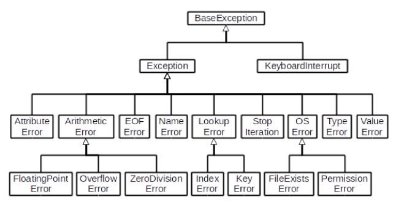

## 객체 지향 프로그래밍

- 객체지향 프로그래밍(영어: Object-Oriented Programming, OOP)은 컴퓨터 프로그래밍의 패러다임(방법론) 중 하나이다.
- 컴퓨터 프로그램을 명령어의 목록으로 보는 시각에서 벗어나 여러 개의 독립된 단위, 즉 **"객체"** 들의 모임으로 파악하고자 하는 것이다. 각각의 객체는 메시지를 주고받고, 데이터를 처리할 수 있다.

* 과거의 절차지향 프로그래밍: 글로벌 데이터에 여러개의 함수를 이용함
  

* 객체 지향 프로그래밍: 데이터와 기능(메서드) 분리, 추상화된 구조(인터페이스)
  

* 현실 세계를 프로그램 설계에 반영(추상화)
     - 사람이 노래하고, 그림 그리고 ...

### 객체지향의 장점/단점

- 장점
     - 클래스 단위로 모듈화시켜 개발할 수 있으므로 많은 인원이 참여하는 대규모 소프트웨어 개발에 적합
     - 필요한 부분만 수정하기 쉽기 때문에 프로그램의 유지보수가 쉬움
- 단점
     - 설계 시 많은 노력과 시간이 필요함
          - 다양한 객체들의 상호 작용 구조를 만들기 위해 많은 시간과 노력이 필요
     - 실행 속도가 상대적으로 느림
          - 사람이 편하면 컴퓨터가 힘들다.
          - 절차 지향 프로그래밍이 컴퓨터의 처리구조와 비슷해서 실행 속도가 빠름

## 객체(컴퓨터 과학)

- 컴퓨터 과학에서 객체 또는 오브젝트(object)는 클래스에서 정의한 것을 토대로 메모리(실제 저장공간)에 할당된 것으로 프로그램에서 사용되는 데이터 또는 식별자에 의해 참조되는 공간을 의미하며, 변수, 자료 구조, 함수 또는 메서드가 될 수 있다.

### 클래스와 객체, 인스턴스

- 객체는 속성(변수)와 행동(함수)로 이루어져있다

     - 가수
       -> 속: 이름, 그룹, 키
       -> 행동: 노래하기, 춤추기

- 클래스 = 설계도, 객체 = 실제 사례
     - 가수(클래스), 이찬혁(객체)
- 클래스로 만든 객체를 인스턴스라고도 한다. 특정 타입의(클래스의) 인스턴스다. 라고 표현함.
     - 이찬혁은 객체다. (O)
     - 이찬혁은 인스턴스다. (X)
     - 이찬혁은 **가수**의 인스턴스다. (O)
- 클래스를 만든다 == 타입을 만든다.
- **파이썬은 모든 것이 객체이기 때문에 모든 것에 속성과 행동이 존재한다.**
     - 객체.행동()
     - [3, 2, 1].sort()
       -> 리스트.정렬()
     - 'banana'.upper()
       -> 문자열.대문자로()
- 객체(object)의 특징
     - 타입(type): 어떤 연산자(operator)와 조작(method)이 가능한가?
     - 속성(attribute): 어떤 상태(데이터)를 가지는가?
     - 조작법(method): 어떤 행위(함수)를 할 수 있는가?
       => **객체(Object) = 속성(Attribute) + 기능(Method)**

## 객체와 클래스 문법

### 기본 문법

- 클래스 정의: `class Myclass:`
- 인스턴스 생성: `my_instance = MyClass()`
- 메서드 호출: `my_instance.my_method()`
- 속성: `my_instance.my_attribute`
- 객체 비교하기
     - ==: 동등한(equal)
          - 변수가 참조하는 객체가 동등한(내용이 같은) 경우 True
          - 두 객체가 같아 보이지만 실제로 동일한 대상을 가리키고 있다고 확인해 준 것은 아님
          - 생긴 것이 같은 경우 True
     - is: 동일한(identical)
          - 두 변수가 동일한 객체를 가리키는 경우 True

### 속성

- 특정 데이터 타입/클래스의 객체들이 가지게 될 상태/데이터를 의미
- 클래스 변수/인스턴스 변수가 존재

```
class Person:
    blood_color='red' # 클래스 변수
    population = 100  # 클래스 변수
    def __init__(self, name):
        self.name = name # 인스턴스 변수
person1 = Person ('지민')
print (person1.name) # 지민
```

- 인스턴스 변수(각각)
     - 인스턴스가 개인적으로 가지고 있는 속성(attribute)
     - 각 인스턴스들의 고유한 변수
     - 생성자 메서드(\__init_)에서 `self.<name>`으로 정의
     - 인스턴스가 생성된 이후 `<instance>.<name>`으로 접근 및 할당
- 클래스 변수(공용)
     - 클래스 선언 내부에서 정의
     - `<classname>.<name>`으로 접근 및 할당
     - 클래스 변수 활용
          - 사용자가 몇 명인지 확인하고 싶다면? 인스턴스가 생성 될 때마다 클래스 변수가 늘어나도록 설정하면 됨
          ```
          class Person:
              count = 0
              # 인스턴스 변수 설정
              def __init__(self, name):
                  self.name = name
                  Person.count += 1
          person1 = Person ('아이유')
          person2= Person ('이찬혁')
          print (Person.count) # 2
          ```
     - 클래스 변수를 변경할 때는 항상 `<클래스>.<클래스변수>` 형식으로 변경
          - `<인스턴스>.<클래스변수>`를 변경할 경우 새로운 인스턴스 변수가 생성됨

### 메서드

- 특정 데이터 타입/클래스의 객체에 공통적으로 적용 가능한 행위(함수)
- 인스턴스 메서드
     - 인스턴스 변수를 사용하거나, 인스턴스 변수에 값을 설정하는 메서드
     - 클래스 내부에 정의되는 메서드의 기본
     - 호출 시, 첫 번째 인자로 인스턴스 자기자신(self)이 전달됨. self를 사용하는 이유는 파이썬의 암묵적인 규칙이기 때문
- 생성자(constructor) 메서드
     - 인스턴스 객체가 생성될 때 자동으로 호출되는 메서드
     - 인스턴스 변수들의 초기값을 설정
          - 인스턴스 생성
          - `__init__` 메서드 자동 호출
     - 매직 메서드: Double underscore(\_\_)가 있는 메서드. 스페셜 메서드라고도 불림. 특정 상황에 자동으로 불리는 메서드
          - `__str__(self)`: `print()`, 해당 객체의 출력 형태를 지정
          - `__eq__(self, other)`: `==`
          - `__gt__(self, other)`: `>`
          - `__del__(self)`: 소멸자(destructor) 메서드. 인스턴스 객체가 소멸되기 직전에 호출됨
- 클래스 메서드

     - 클래스가 사용할 메서드
     - `@classmethod` 데코레이터를 사용하여 정의
     - 호출 시, 첫 번째 인자로 클래스(cls)가 전달됨
     - 데코레이터: 함수를 어떤 함수로 꾸며서 새로운 기능을 부여

          - `@데코레이터(함수명)` 형태로 함수 위에 작성
          - 순서대로 적용 되기 때문에 작성 순서가 중요

          ```
          # 데코레이팅 함수
          def add_print(original):  # 파라미터로 함수를 받는다.
              def wrapper(): # 함수 내에서 새로운 함수 선언
                  print("함수 시작") # 부가기능 -> original을 꾸민다.
                  original()
                  print("함수 끝") # 부가기능 -> original을 꾸민다.
              return wrapper # 함수를 return 한다.

          @add_print # add_print를 사용해서 print_hello()함수를 꾸며주도록 하는 명령어
          def print_hello():
              print("hello")
          print_hello()
          # "함수 시작"
          # "hello"
          # "함수 끝"
          ```

- 클래스 메서드와 인스턴스 메서드 차이

     - 클래스 메서드: 클래스 변수(cls) 사용, 인스턴스 변수 사용 불가능
     - 인스턴스 메서드: 인스턴스 변수(self) 사용, 클래스 변수와 인스턴스 변수 둘 다 사용 가능

- 스태틱 메서드
     - 인스턴스 변수(self), 클래스 변수(cls)를 전혀 다루지 않는 메서드
     - 속성을 다루지 않고 단지 기능(행동)만을 하는 메서드를 정의할 때 사용. 즉, 객체 상태나 클래스 상태를 수정할 수 없음
     - `@staticmethod` 데코레이터를 사용하여 정의
     - 일반 함수처럼 동작하지만, 클래스의 이름공간에 귀속됨
- 인스턴스와 클래스 간의 이름공간(namespace)

     - 클래스를 정의하면, 클래스와 해당하는 이름 공간 생성
     - 인스턴스를 만들면, 인스턴스 객체가 생성되고 이름 공간 생성
     - 인스턴스에서 특정 속성에 접근하면, 인스턴스-클래스 순으로 탐색

     ```
     # Person
     class Person:
         name = 'unknown'

         def talk(self):
             print (self.name)

     p1 = Person ()
     p1.talk () # unknown

     #p2 인스턴스 변수 설정 전/후
     p2 = Person ()
     p2.talk () # unknown
     p2.name = 'Kim'
     p2.talk() # Kim

     print (Person.name) # unknown
     print (p1.name) # unknown, 클래스 변수(인스턴스 변수가 정의되어 있지 않기 때문)
     print (p2.name) # Kim, 인스턴스 변수
     ```

* 메서드 정리

     - 인스턴스 메서드: 호출한 인스턴스를 의미하는 self 매개변수를 통해 인스턴스를 조작
     - 클래스 메서드: 클래스를 의미하는 cls 매개 변수를 통해 클래스를 조작
     - 스태틱 메서드: 클래스 변수나 인스턴스 변수를 사용하지 않는 경우에 사용, 객체 상태나 클래스 상태를 수정할 수 없음

     ```
     class MyClass:
         def method (self):
             return 'instance method', self

         @classmethod
         def classmethod (cls):
             return 'class method', cls

         @staticmethod
         def staticmethod():
             return 'static method'
     obj = MyClass()
     print(obj.method())
     print(MyClass.method(obj))  # 이것도 가능하지만 권장하지 않는 방법
     ```

     - 클래스 자체에서 인스턴스 메서드는 호출할 수 없음
     - 인스턴스는 클래스 메서드와 스태틱 메서드 모두 접근할 수 있음

## 객체 지향의 핵심 개념

### 추상화

- 현실 세계를 프로그램 설계에 반영. 복잡한 것은 숨기고 필요한 것만 드러내기
- login, logout이 어떻게 돌아가는지 유저는 몰라도 됨

### 상속

- 두 클래스 사이 부모-자식 관계를 정립하는 것
- 클래스는 상속이 가능함. 모든 파이썬 클래스는 object를 상속받음.
  `class ChildClass(ParentClass):`
- 하위 클래스는 상위 클래스에 정의된 속성, 행동, 관계 및 제약 조건을 모두 상속 받음
- 부모 클래스의 속성, 메서드가 자식 클래스에 상속되므로, 코드 재사용성이 높아짐

* 상속 관련 함수와 메서드
     - `isinstance(object, classinfo)`: classinfo의 instance거나 subclass인 경우 True
     - `issubclass(class, classinfo)`: class가 classinfo의 subclass면 True. classinfo는 클래스 객체의 튜플일 수 있으며, classinfo의 모든 항목을 검사
     - `super()`: 자식클래스에서 부모클래스를 사용하고 싶은 경우
* 상속 정리
     - 파이썬의 모든 클래스는 object로부터 상속됨
     - 부모 클래스의 모든 요소(속성, 메서드)가 상속됨
     - super()를 통해 부모 클래스의 요소를 호출할 수 있음
     - 메서드 오버라이딩을 통해 자식 클래스에서 재정의 가능함
     - 상속관계에서의 이름 공간은 인스턴스, 자식 클래스, 부모 클래스 순으로 탐색
* 다중 상속
     - 두 개 이상의 클래스를 상속 받는 경우
     - 상속 받은 모든 클래스의 요소를 활용 가능함
     - 중복된 속성이나 메서드가 있는 경우 상속 순서에 의해 결정됨
     - mro 메서드(Method Resolution Order): 상속 관련 함수
          - 해당 인스턴스의 클래스가 어떤 부모 클래스를 가지는지 확인하는 메서드
          - 기존의 인스턴스 -> 클래스 순으로 이름 공간을 탐색하는 과정에서 상속 관계에 있으면 인스턴스 -> 자식클래스 -> 부모 클래스로 확장

### 다형성(Polymorphism)

- 여러 모양을 뜻하는 그리스에
- 동일한 메서드가 클래스에 따라 다르게 행동할 수 있음을 의미
- 즉, 서로 다른 클래스에 속해있는 객체들이 **동일한 메세지에 대해 다른 방식으로 응답할 수 있음**
- 메서드 오버라이딩(덮어쓰기)
     - 상속받은 메서드를 재정의
          - 클래스 상속 시, 부모 클래스에서 정의한 메서드를 자식 클래스에서 변경
          - 부모 클래스의 메서드 이름과 기본 기능은 그대로 사용하지만, 특정 기능을 바꾸고 싶을 때 사용
          - 상속받은 클래스에서의 같은 이름의 메서드로 덮어씀
          - 부모 클래스의 메서드를 실행시키고 싶을 경우 super()를 활용

### 캡슐화

- 객체의 일부 구현 내용에 대해 외부로부터의 직접적인 액세스를 차단(주민번호)
- 파이썬에서 암묵적으로 존재하지만, 언어적으로는 존재하지 않음
- 접근 제어자 종류
     - Public Access Modifier
          - Public Member: 언더바 없이 시작하는 메서드나 속성. 어디서나 호출이 가능하고, 하위 클래스의 override 허용. 일반적으로 작성되ㅣ는 메서드와 속성의 대다수를 차지
     - Protected Access Modifier
          - Protected Member: 언더바 1개로 시작하는 메서드나 속성. 암묵적 규칙에 의해 부모 클래스 내부와 자식 클래스에서만 호출 가능. 하위 클래스 override 허용
     - Private Access Modifier
          - Private Member: 언더바 2개로 시작하는 메서드나 속성. 본 클래스 내부에서만 사용 가능. 하위 클래스 상속 및 호출, 외부 호출 불가능(오류 발생)
- getter, setter
     - 변수에 접근할 수 있는 메서드를 별도로 생성
     - getter 메서드: 변수의 값을 읽는 메서드. @property 데코레이터 사용
     - setter 메서드: 변수의 값을 설정하는 성격의 메서드. @변수.setter 사용
     - 바꾸면 안되는 것들을 바꾸거나, 오류를 방지하기 위해 표시하는 느낌.

## 에러와 예외처리

### 디버깅

- 버그: 소프트웨어에서 발생하는 문제
- 디버깅: 잘못된 프로그램을 수정하는 것
- 에러 메세지가 발생하는 경우: 해당 위치를 찾아 메세지를 해결
- 로직 에러가 발생하는 경우
     - 명시적인 에러 메세지 없이 예상과 다른 결과가 나온 경우
- 오류가 많이 발생하는 곳: 제어가 되는 시점, 조건/반복, 함수
- 디버깅 하는 법
     - print 함수 활용
          - 특정 함수 결과, 반복/조건 결과 등 나눠서 생각, 코드를 bisection으로 나눠서 생각
     - 개발 환경(text editor, IDE) 등에서 제공하는 기능(breakpoint, 변수 조회) 활용
     - Python tutor 활용 (단순 파이썬 코드인 경우)
     - 뇌컴파일, 눈디버깅

### 문법 에러(Syntax Error)

- 파이썬 프로그램은 문법 에러가 있으면 실행이 되지 않음
- 파일이름, 줄번호, ^문자를 통해 파이썬이 코드를 읽어 나갈 때(parser) 문제가 발생한 위치를 표현
- 줄에서 에러가 감지된 가장 앞의 위치를 가리키는 캐럿(caret)기호(^)를 표시
- Invalid syntax: 문법 오류
- assign to literal: 잘못된 할당
- EOL(End of Line), EOF(End of File)

### 예외 (Exception)

- 실행 도중 예상치 못한 상황을 맞이하면, 프로그램 실행을 멈춤
     - 문장이나 표현식이 문법적으로 올바르더라도 발생하는 에러
- 실행 중에 감지되는 에러들을 예외(Exception)라고 부름
- 예외는 여러 타입(type)으로 나타나고, 타입이 메시지의 일부로 출력됨
     - NameError, TypeError 등은 발생한 예외 타입의 종류(이름)
- 모든 내장 예외는 Exception Class를 상속받아 이뤄짐
- 사용자 정의 예외를 만들어 관리할 수 있음

### 예외의 종류

- ZeroDivisionError: 0으로 나누고자 할 때 발생
- NameError: namespace상에 이름이 없는 경우
- TypeError: 타입 불일치, argument 누락, argument 개수 초과, argument type 불일치
- ValueError: 타입은 올바르나 값이 적절하지 않거나 없는 경우
- IndexError: 인덱스가 존재하지 않거나 범위를 벗어나는 경우
- KeyError: 해당 키가 존재하지 않는 경우
- ModuleNotFoundError: Module을 찾지 못한 경우
- ImportError: Module은 있으나 존재하지 않는 클래스/함수를 가져오는 경우
- KeyboardInterrupt: 임의로 프로그램을 종료하였을 때
- IndentationError: Indentation이 적절하지 않은 경우
- 파이썬 내장 예외의 클래스 계층 구조
  

## 예외 처리

- try 문(statement)
     - 오류가 발생할 가능성이 있는 코드를 실행
     - 예외가 발생되지 않으면, except 없이 실행 종료
- except 절(clause)
     - 예외가 발생하면, except 절이 실행
     - 예외 상황을 처리하는 코드를 받아서 적절한 조치를 취함

* 예외 처리 순서
  

```
try:
    try 명령문
except 예외그룹-1 as 변수-1:
    예외처리 명령문 1
except 예외그룹-2 as 변수-2:
    예외처리 명령문 2
finally:    # 선택사항
    finally 명령문

try:
    num = input('숫자 입력 :')
    print(int(num))
except ValueError:
    print('숫자가 입력되지 않았습니다.')
```

- 에러 메세지 처리(as): as 키워드를 활용하여 원본 에러 메세지를 사용할 수 있음

```
try:
    num = input('숫자 입력 :')
    print(int(num))
except ValueError as err:
    print(f'{err}, 숫자가 입력되지 않았습니다.')
    # ValueError,  숫자가 입력되지 않았습니다.
```

- 예외 처리 종합
     - try: 코드를 실행함
     - except: try문에서 예외가 발생 시 실행함
     - else: try문에서 예외가 발생하지 않으면 실행함
     - finally: 예외 발생 여부와 관계 없이 항상 실행함
