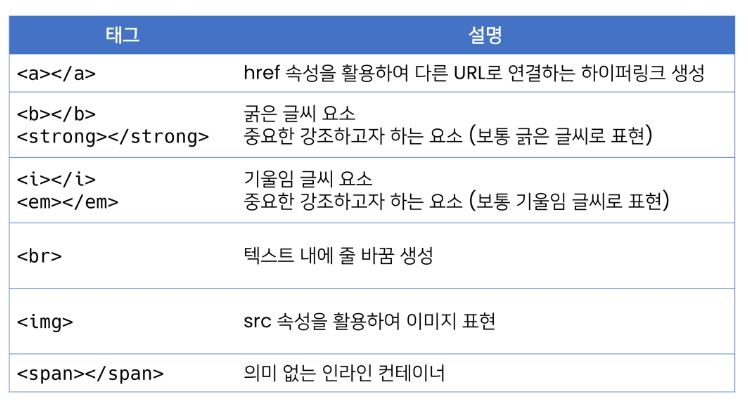
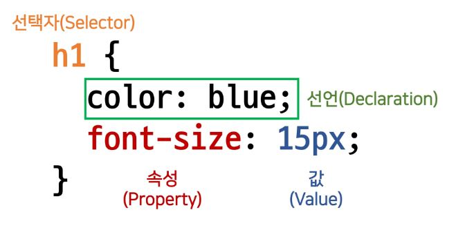
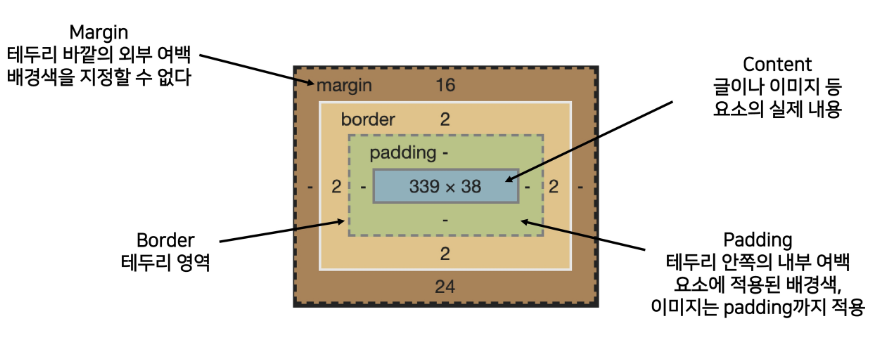
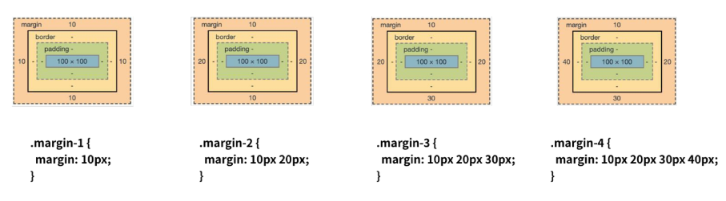

## HTML

- Hyper Text Markup Language
- Hyper Text: 참조(하이퍼링크)를 통해 사용자가 한 문서에서 다른 문서로 즉시 접근할 수 있는 텍스트
- Markup Language: 태그 등을 이용하여 문서나 데이터의 구조를 명시하는 언어(HTML, Markdown)

```html
<h1>HTML</h1>
<p>HTML이란 Hyper Text Markup Language의 약자이다.</p>
```

- HTML이란 웹페이지를 작성(구조화)하기 위한 언어이다.

## HTML 기본 구조

- html: 문서의 최상위(root) 요소
- head: 문서 메타데이터 요소
  - 문서 제목, 인코딩, 스타일, 외부 파일 로딩 등
  - 일반적으로 브라우저에 나타나지 않는 내용
  - head 예시: Open Graph Protocol(메타 데이터를 표현하는 새로운 규약)
- body: 문서 본문 요소. 실제 화면 구성과 관련된 내용

### 요소(element)

- 태그 + 내용
- HTML 요소는 시작 태그와 종료 태그 그리고 태그 사이에 위치한 내용으로 구성
  - 요소는 태그로 컨텐츠(내용)를 감싸는 것으로 그 정보의 성격과 의미를 정의
  - 내용이 없는 태그들도 존재(닫는 태그가 없음)
    - br, hr, img, input, link, meta
- 요소는 중첩(nested)될 수 있음
  - 요소의 중첩을 통해 하나의 문서를 구조화
  - 여는 태그와 닫는 태그의 쌍을 잘 확인해야함
    - 오류를 반환하는 것이 아닌 그냥 레이아웃이 깨진 상태로 출력되기 때문에, 디버깅이 힘들어 질 수 있음
- 속성(attribute)
- 속성을 통해 태그의 부가적인 정보를 설정할 수 있음
- 요소는 속성을 가질 수 있으며, 경로나 크기와 같은 추가적인 정보를 제공
- 요소의 시작 태그에 작성하며 보통 이름과 값이 하나의 쌍으로 존재
- 태그와 상관없이 사용 가능한 속성(HTML Global Attribute)들도 있음
- HTML Global Attribute: 모든 HTML 요소가 공통으로 사용할 수 있는 대표적인 속성(몇몇 요소에는 아무 효과가 없을 수 있음)
  - id : 문서 전체에서 유일한 고유 식별자 지정
  - class : 공백으로 구분된 해당 요소의 클래스의 목록 (CSS, JS에서 요소를 선택하거나 접근)
  - data-\* : 페이지에 개인 사용자 정의 데이터를 저장하기 위해 사용(좋아요)
  - style : inline 스타일
  - title : 요소에 대한 추가 정보 지정
  - tabindex : 요소의 탭 순서
- 시멘틱 태그: HTML 태그가 특정 목적, 역할 및 의미적 가치(semantic value)를 가지는 것
  - h1 태그: 이 페이지에서 최상위 제목인 텍스트를 감싸는 역할(또는 의미)을 나타냄
  - Non semantic 요소: div, span / semantic 태크: a, form, table
  - 대표적인 시맨틱 태그 목록
    - header : 문서 전체나 섹션의 헤더(머리말 부분)
    - nav : 내비게이션
    - aside : 사이드에 위치한 공간, 메인 콘텐츠와 관련성이 적은 콘텐츠
    - section: 문서의 일반적인 구분, 컨텐츠의 그룹을 표현
    - article: 문서, 페이지, 사이트 안에서 독립적으로 구분되는 영역
    - footer : 문서 전체나 섹션의 푸터(마지막 부분)
  - 사용해야 하는 이유: 의미론적 마크업
    - 개발자 및 사용자 뿐만 아니라 검색엔진 등에 의미 있는 정보의 그룹을 태그로 표현
    - 단순히 구역을 나누는 것 뿐만 아니라 '의미'를 가지는 태그들을 활용하기 위한 노력
    - 요소의 의미가 명확해지기 때문에 코드의 가독성을 높이고 유지보수를 쉽게 함
    - 검색엔진최적화(SEO)를 위해서 메타태그, 시맨틱 태그 등을 통한 마크업을 효과적으로 활용 해야함

### 텍스트로 작성된 코드가 어떻게 웹사이트가 되는걸까

- 렌더링(Rendering): 웹사이트 코드를 사용자가 보게 되는 웹 사이트로 바꾸는 과정
- DOM(Document Object Model) 트리: 텍스트 파일인 HTML 문서를 브라우저에서 렌더링 학기 위한 구조
  - HTML 문서에 대한 모델을 ㄱ구성함
  - HTML 문서 내의 각 요소에 접근 / 수정에 필요한 프로퍼티와 메서드를 제공함

## HTML 문서 구조화

### 인라인 / 블록 요소

- 인라인 요소: 글자처럼 추급
- 블록 요소: 한 줄 모두 사용
- 텍스트 요소
  
- 그룹 컨텐츠:
  

### form

- `<form>` 은 정보(데이터)를 서버에 제출하기 위해 사용하는 태그(로그인창)
- `<form>` 기본 속성
  - action: form을 처리할 서버의 URL(데이터를 보낼 곳)
  - method:form을 제출할 때 사용할 HTTP 메서드 (GET 혹은 POST)
  - enctype: method post인 경우 데이터의 유형
    - application/x-www-form-urlencoded: 기본값
    - multipart/form-data: 파일 전송시 (input type이 file인 경우)
    - text/plain : HTML5 디버깅 용 (잘 사용되지 않음)

### input

- 다양한 타입을 가지는 입력 데이터 유형과 위젯이 제공됨
- `<input>` 대표적인 속성
  - name:form control에 적용되는 이름 (이름/값 페어로 전송됨)
  - value: form control에 적용되는 값 (이름/값 페어로 전송됨)
  - required, readonly, autofocus, autocomplete, disabled 등
- input label: label을 클릭하여 input 자체의 초점을 맞추거나 활성화 시킬 수 있음
  - 사용자는 선택할 수 있는 영역이 늘어나 웹/모바일(터치) 환경에서 편하게 사용할 수 있음
  - label과 input 입력의 관계가 시각적 뿐만 아니라 화면리더기에서도 label을 읽어 쉽게 내용을 확인 할 수 있도록 함
- `<input>`에 id 속성을, `<label>에는 for 속성을 활용하여 상호 연관을 시킴
- input 유형 - 일반: 일반적으로 입력을 받기 위하여 제공되며 타입별로 HTML기본 검증 혹은 추가 속성을 활용할 수 있음
  - text : 일반 텍스트 입력
  - password : 입력 시 값이 보이지 않고 문자를 특수기호(\*)로 표현
  - email : 이메일 형식이 아닌 경우 form 제출 불가
  - number:min, max, step 속성을 활용하여 숫자 범위 설정 가능
  - file: accept 속성을 활용하여 파일 타입 지정 가능
  - checkbox: 체크박스
- input 유형 - 항목 중 선택: 일반적으로 label 태그와 함께 사용하여 선택 항목을 작성함
  - 동일 항목에 대하여는 name을 지정하고 선택된 항목에 대한 value를 지정해야 함
  - checkbox: 다중선택
  - radio: 단일 선택
- input 유형 - 기타:
  - 다양한 종류의 input을 위한 picker 제공
    - color: color picker
    - date: date picker
  - hidden input을 활용하여 사용자 입려을 받지 않고 서버에 전송되어야 하는 값을 설정

## CSS

- Cascading Style Sheets: 스타일을 지정하기 위한 언어. 선택 -> 지정
  
- CSS 구문은 선택자를 통해 스타일을 지정할 HTML 요소를 선택
- 중괄호 안에서는 속성과 값, 하나의 쌍으로 이루어진 선언을 진행
- 각 쌍은 선택한 요소의 속성, 속성에 부여할 값을 의미
  - 속성 (Property) : 어떤 스타일 기능을 변경할지 결정
  - 값 (Value) : 어떻게 스타일 기능을 변경할지 결정
- CSS 정의 방법
  - 인라인(inline): `<h1 style="color: blue; font-size: 100px;">Hello</h1>`
  - 내부 참조(embedding) - `<style>`: `<head>` 태그 내에 `<style>`에 지정
  - 외부 참조(link file) - 분리된 CSS 파일. 가장 많이 쓰는 방식
- CSS with 개발자 도구
  - styles: 해당 요소에 선언된 모든 CSS, 내가 우너하는 것을 껐다 켰다 하며 테스트 할 수 있다
  - computed: 해당 요소에 최종 계산된 CSS

### CSS selectors


- 기본 선택자
  - 전체 선택자, 요소 선택자(태그 선택)
  - 클래스 선택자, 아이디 선택자, 속성 선택자
  - 요소 = 서울사람 -> 클래스 = 최씨, 김씨 -> 아이디 = 지웅, 길동
  - 범위가 좁아질 수록 파워가 강해짐
- 결합자(Combinators)
  - 자손 결합자, 자식 결합자
  - 일반 형제 결합자, 인접 형제 결합자
- 의사 클래스/요소(Pseudo Class)
  - 링크, 동적 의사 클래스
  - 구조적 의사 클래스, 기타 의사 클래스, 의사 엘리먼트, 속성 선택자
- 요소 선택자
  - HTML 태그를 직접 선택
- 클래스(class) 선택자
  - 마침표(.)문자로 시작하며, 해당 클래스가 적용된 항목을 선택: `.green{color: green;}`
- 아이디(id) 선택자
  - `#` 문자로 시작하며, 해당 아이디가 적용된 항목을 선택: `#purple{color: purple;}`
  - 일반적으로 하나의 문서에 1번만 사용
  - 여러 번 사용해도 동작하지만, 단일 id를 사용하는 것을 권장

* CSS 적용 우선순위(cascading order)
  1.  중요도(Importance) - 사용시 주의: `!important`
  2.  우선순위(Specificity): 인라인 > id > class, 속성, pseduo-class > 요소, pseduo-eement
  3.  CSS 파일 로딩 순서(파일 밑에 있는 것이 이김)

### CSS 상속

- CSS는 상속을 통해 부모 요소의 속성을 자식에게 상속한다.
- 속성(프로퍼티) 중에는 상속이 되는 것과 되지 않는 것들이 있다.
- 상속 되는 것: Text 관련 요소(font, color, text-align), opacity, visibility 등
- 상속 되지 않는 것: Box model 관련 요소(width, height, margin, padding, border, box-sizing, display), position 관련 요소(position, top/right/bottom/left, z-index) 등

## CSS 기본 스타일

### 크기 단위

- px(픽셀): 모니터 해상도의 한 화소인 '픽셀' 기준. 픽셀의 크기는 변하지 않기 때문에 고정적인 단위
- %: 백분율 단위. 가변적인 레이아웃에서 자주 사용
- em: (바로 위, 부모 요소에 대한) 상속의 영향을 받음. 배수 단위, 요소에 지정된 사이즈에 상대적인 사이즈를 가짐
- rem: (바로 위, 부모 요소에 대한) 상속의 영향을 받지 않음. 최상위 요소(html) 사이즈를 기준으로 배수 단위를 가짐
- viewport: 웹페이지를 방문한 유저에게 바로 보이게 되는 웹 컨텐츠의 영역(디바이스 화면)
  - 디바이스의 viewport를 기준으로 상대적인 사이즈가 결정됨
  - vw, vh, vmin, vmax

### 색상 단위

- 색상 키워드(background-color: red;)
  - 대소문자를 구분하지 않음
  - red, blue, black 과 같은 특정 색을 직접 글자로 나타냄
- RGB 색상(background-color: rgb(0, 255, 0);)
  - 16진수 표기법 혹은 함수형 표기법을 사용해서 특정 색을 표현하는 방식
- HSL 색상(background-color: hsl(0, 100%, 50%);)
  - 색상, 채도, 명도를 통해 특정 색을 표현하는 방식}

### 문서 표현 - 추후에...

- 텍스트
  - 서체(font-family), 서체 스타일(font-style, font-weight 등)
  - 자간(letter-spacing), 단어 간격(word-spacing), 행간(line-height) 등
- 컬러(color), 배경(background-image, background-color)
- 기타 HTML 태그별 스타일링
  - 목록(li), 표(table)

### 결합자(Combinators)

- 자손 결합자(공백): selectorA 하위의 모든 selectorB 요소
- 자식 결합자(>): selectorA 바로 아래의 selectorB 요소
- 일반 형제 결합자(~): selectorA의 형제 요소 중 뒤에 위치하는 selectorB 요소를 모두 선택
- 인접 형제 결합자(+): selectorA의 형제 요소 중 바로 뒤에 위치하는 selectorB 요소를 선택
- 자손, 자식만 확실히 기억해두기

### CSS Box Model

- 모든 요소는 네모(박스 모델)이고, 위에서부터 아래로, 왼쪽에서 오른쪽으로 쌓인다(좌측 상단에 배치)
- 모든 HTML 요소는 box 형태로 되어있음
- 하나의 박스는 네 부분(영역)으로 이루어짐
  - margin
  - border
  - padding
  - content
- Box modl 구성
  
- shorthand
  
- 기본적으로 모든 요소의 box-sizing은 content-box의 사이즈를 지정하는 것
  - Padding을 제외한 순수 contents 영역만을 box로 지정
- 다만, 우리가 일반적으로 영역을 볼 때는 border까지의 너비를 100px 보는 것을 원함
  - 그 경우 box-sizing을 border-box로 설정

### CSS display

- 모든 요소는 네모(박스 모델)이고, 좌측 상단에 배치된다.
- display에 따라 크기와 배치가 달라진다
- display: block
  - 줄 바꿈이 일어나는 요소
  - 화면 크기 전체의 가로 폭을 차지한다.
  - 블록 레벨 요소 안에 인라인 레벨 요소가 들어갈 수 있음.
- display: inline
  - 글자처럼 취급
  - 줄 바꿈이 일어나지 않는 행의 일부 요소
  - content 너비만큼 가로 폭을 차지한다.
  - width, height, margin-top, margin-bottom을 지정할 수 없다.
  - 상하 여백은 line-height로 지정한다.
- 블록 레벨 요소와 인라인 레벨 요소 구분 (HTML 4.1까지)
- 대표적인 블록 레벨 요소: div /ul,ol, li/p/ hr / form 등
- 대표적인 인라인 레벨 요소: span / a / img / input, label / b, em, i, strong 등
- display: inline-block
  - block과 inline 레벨 요소의 특징을 모두 가짐
  - inline처럼 한 줄에 표시할 수 있고, block처럼 width, height, margin 속성을 모두 지정할 수 있음
- display: none
  - 해당 요소를 화면에 표시하지 않고, 공간조차 부여되지 않음이와 비슷한 visibility: hidden은 해당 요소가 공간은 차지하나 화면에 표시만 하지 않는다.

### CSS position

- 레이아웃 결정할 때 사용
- 문서 상에서 요소의 위치를 지정
  - static: 모든 태그의 기본 값(기준 위치)
    - 일반적인 요소의 배치 순서에 따름(좌측 상단)
    - 부모 요소 내에서 배치될 때는 부모 요소의 위치를 기준으로 배치 됨
- 아래는 좌표 프로퍼티(top, bottom, left, right)를 사용하여 이동 가능
  1.  relative: 상대 위치
  - 자기 자신의 static 위치를 기준으로 이동 (normal flow 유지)
  - 레이아웃에서 요소가 차지하는 공간은 static일 때와 같음 (normal position 대비 offset)
  2.  absolute: 절대 위치
  - 요소를 일반적인 문서 흐름에서 제거 후 레이아웃에 공간을 차지하지 않음 (normal flow에서 벗어남)
  3.  fixed: 고정 위치
  - 요소를 일반적인 문서 흐름에서 제거 후 레이아웃에 공간을 차지하지 않음 (normal flow에서 벗어남)
  - 부모 요소와 관계없이 viewport를 기준으로 이동
  - 스크롤 시에도 항상 같은 곳에 위치함
  4.  sticky : 스크롤에 따라 static -> fixed 로 변경
  - 속성을 적용한 박스는 평소에 문서 안에서 position: static와 같이 일반적인 흐름에 따르지만 스크롤 위치가 임계점에 이르면 position: fixed와 같이 박스를 화면에 고정할 수 있는 속성

### CSS 원칙

- CSS 원칙 I, II : Normal flow
  - 모든 요소는 네모(박스모델), 좌측상단에 배치
  - display에 따라 크기와 배치가 달라짐
- CSS 원칙 III
  - position으로 위치의 기준을 변경
  - relative: 본인의 원래 위치
  - absolute : 특정 부모의 위치
  - fixed : 화면의 위치
  - sticky: 기본적으로 static이나 스크롤 이동에 따라 fixed로 변경
