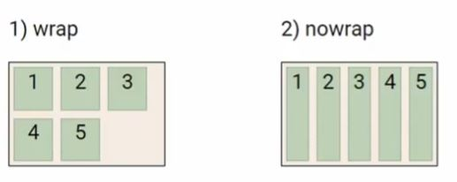
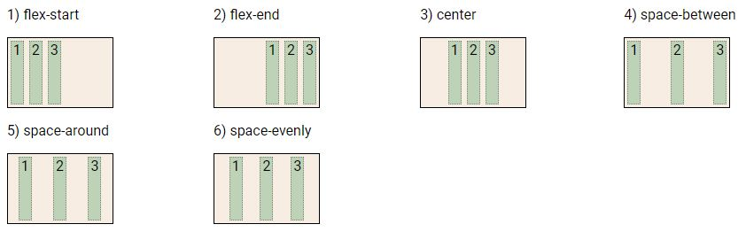
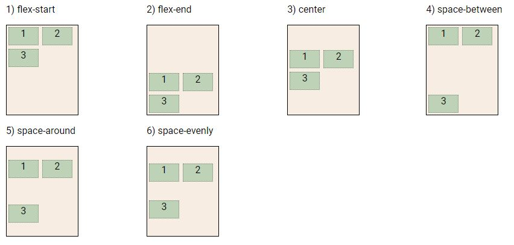
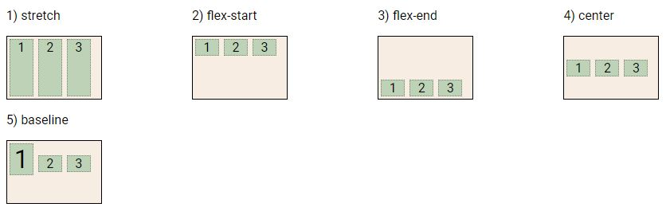
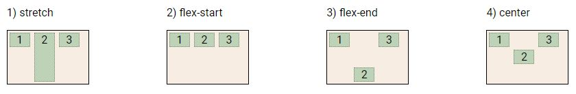
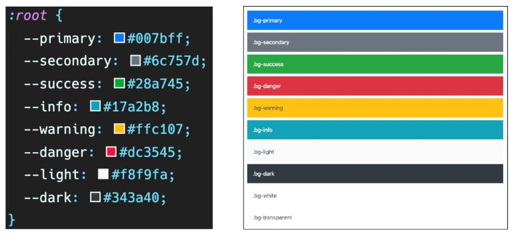

### CSS layout techniques

- Display
- Position
- Float(요즘에는 잘 안씀)
- Flexbox(요즘 주로 활용)
- Grid
- 기타(Responsive Web Design, Media Queries)

### CSS 원칙 1

- Inline Direction: 왼쪽에서 오른쪽으로
- Block Direction: 위에서 아래로
- 모든 요소는 네모(박스모델)이고, 위에서부터 아래로, 왼쪽에서 오른쪽으로 쌓인다.
- 그렇다면 어떤 요소를 감싸는 형태로 배치는? 좌/우측에 배치는?

### Float

- 박스를 왼쪽 혹은 오른쪽으로 이동시켜 텍스트를 포함 인라인요소들이 주변을 wrapping하도록 함
- 요소가 Normal Flow를 벗어나도록 함
- 속성
     - none: 기본값
     - left: 요소를 왼쪽으로 띄움
     - right: 요소를 오른쪽으로 띄움
- 활용 사례: 메뉴를 왼쪽/오른쪽으로 나눌 때

### CSS Flexible Box Layout(Flexbox)

- 행과 열 형태로 아이템들을 배치하는 1차원 레이아웃 모델
- 축

     - main axis(메인 축)
     - cross axis(교차 축)

- 구성 요소

     - Flex Container(부모 요소)
     - Flex Item(자식 요소)

- 부모요소에 `display: flex;` 혹은 `display: inline-flex;`를 설정해야 한다.
- 이전까지는 Floagt 혹은 Position으로 Normal Flow를 벗어나야 했는데, 너무 불편했다.

     - 수직 정렬, 아이템의 너비와 높이 혹은 간격을 동일하게 배치하기 어려움

- Flex 속성

     - 배치 설정
          - flex-direction(row, row-reverse, column, colums-reverse): Main axis의 방향을 설정
          - flex-wrap: 아이템이 컨테이너를 벗어나는 경우 해당 영역 내에 배치되도록 설정. 기본적으로 컨테이너 영역을 벗어나지 않도록 함
               - nowrap(기본값): 강제로 한 줄에 배치
               - wrap: 넘치면 그 다음 줄로 배치
                 
          - flex-flow: flex-direction과 flex-wrap의 shorthand(ex. `flex-flow: row nowrap;`)
     - 공간 나누기
          - justify-content: main axis를 기준으로 공간 배분
            
          - align-content(cross axis, 상하 간격)
            
               - 공간 배분
                    - flex-start (기본 값) : 아이템들을 axis 시작점으로
                    - flex-end: 아이템들을 axis 끝 쪽으로
                    - center : 아이템들을 axis 중앙으로
                    - space-between : 아이템 사이의 간격을 균일하게 분배
                    - space-around : 아이템을 둘러싼 영역을 균일하게 분배 (가질 수 있는 영역을 반으로 나눠서 양쪽에)
                    - space-evenly : 전체 영역에서 아이템 간 간격을 균일하게 분배
          - justify가 기준이고 align은 수직이다.
     - 정렬
          - align-items: 모든 아이템을 Cross asix 기준으로 정렬
            
          - align-self: **개별 아이템**을 Cross asix 기준으로 정렬
            

     * Flex에 적용하는 속성
          - flex-grow: 남은 영역을 아이템에 분배
          - order: 배치 순서
            

## Bootstrap

- HTML과의 차이: 더 깔끔하고 마진이 없고 등등..
- [bootstrap download 페이지](https://getbootstrap.com/docs/5.2/getting-started/download/)
- link는 head 안에, scrip는 body 끝나기 직전에 넣는다

### Spacing(margin and padding)

- [spacing](https://getbootstrap.com/docs/5.2/utilities/spacing/)
- `{property}{sides}-{size}`
- {property}: `m`(margin), `p`(padding)
- {sides}: `t`(top), `b`(bottom), `s`(start), `e`(end), `x`(left and right), `y`(top and bottom), blank(all sides)
- {size}: 0(간격 없음), 1(o.25rem, 4px), 2(0.5rem, 8px), 3(1rem, 16px), 4(1.5rem, 24px), 5(3rem, 48px)

### Color

[colors](https://getbootstrap.com/docs/5.2/utilities/colors/)

- `bg-{color}`
  

### Text

[text](https://getbootstrap.com/docs/5.2/utilities/text/)

- `fw`: font weight(bold, normal, light)
- `fst`: font style(italic)
- `text-decoratio-none`: Non-underlined link

### Position

[position](https://getbootstrap.com/docs/5.2/utilities/position/)

- position

```
<div class="position-static">...</div>
<div class="position-relative">...</div>
<div class="position-absolute">...</div>
<div class="position-fixed">...</div>
<div class="position-sticky">...</div>
```

- arrange

```
<div class="position-relative">
  <div class="position-absolute top-0 start-0"></div>
  <div class="position-absolute top-0 end-0"></div>
  <div class="position-absolute top-50 start-50"></div>
  <div class="position-absolute bottom-50 end-50"></div>
  <div class="position-absolute bottom-0 start-0"></div>
  <div class="position-absolute bottom-0 end-0"></div>
</div>
```

### Display

[display](https://getbootstrap.com/docs/5.2/utilities/display/)

- `.d-{value}`
- {value} : none, inline, inline-block, block, grid, table, table-cell, table-row, flex, inline-flex

### Components

- Bootstrap의 다양한 UI 요소를 활용할 수 있음
- 아래 Components 탭 및 검색으로 원하는 UI 요소를 찾을 수 있음
- 기본 제공된 Components를 변환해서 활용
- Buttons: 버튼
- Dropdowns: 옵션 메뉴 만들 때 사용
- Forms > Form controls: input 및 form 태그 스타일링
- Navbar: 네비게이션 바
- Carousel: 콘텐츠(사진을 순환시키기 위한 슬라이드쇼)
- Modal: 사용자와 상호작용하기 위해서 사용하며, 긴급 상황을 알리는 데 주로 사용
     - 현재 열려 있는 페이지 위에 또 다른 레이어를 띄움
     - 페이지를 이동하면 자연스럽게 사라짐(제거를 하지 않고도 배경 클릭시 사라짐)
- Flexbox in Bootstrap: 부트스트랩에서 지원하는 flexbox(`d-flex`)
- Card > Grid Card: 카드를 이용. 화면이 작아지면 1줄에 표시되는 카드의 개수가 줄어듬

### Grid system(web)

[grid](https://getbootstrap.com/docs/5.2/layout/grid/)
[breakpoint](https://getbootstrap.com/docs/5.2/layout/breakpoints/#core-concepts)

- 요소들의 디자인과 배치에 도움을 주는 시스템, flexbox로 제작됨
- 기본 요소
     - Column: 실제 컨텐츠를 포함하는 부분
     - Gutter: 칼럼과 칼럼 사이의 공간(사이 간격)
     - Container: Column들을 담고 있는 공간
- 반드시 기억할 것!!
     - 12개의 column
     - 6개의 grid breakpoints
- 화면 사이즈(breakpoint)에 따라 보이는 요소를 다르게 함

```
<div class="row">
    <div class="box col-2 col-sm-8 col-md-4 col-lg-5">1</div>
    <div class="box col-8 col-sm-2 col-md-4 col-lg-2">2</div>
    <div class="box col-2 col-sm-2 col-md-4 col-lg-5">3</div>
</div>
# lg일때 5:2:5
# md일때 4:4:4
# sm일때 8:2:2
# xs일때 2:8:2
```

- offset: 공간을 비우고 싶을 때

### 헤일리와 공부시간

- URL 가지고 놀기
     - 오늘의 집(ohou.se): 우리나라는 kr, 스웨덴은 se를 사용하는걸 이용해서 자기만의 url을 만들었음.
     - 틀에 갖히지 말고 넓게 생각하고 다양한걸 시도해보자!
- Bootstrap 기본구조
     - container: 기본적으로 margin이 있다
     - container 내부에 row를 넣은 뒤 그 안에 요소를 넣는다. justify-content를 가로로 하기 위해.
